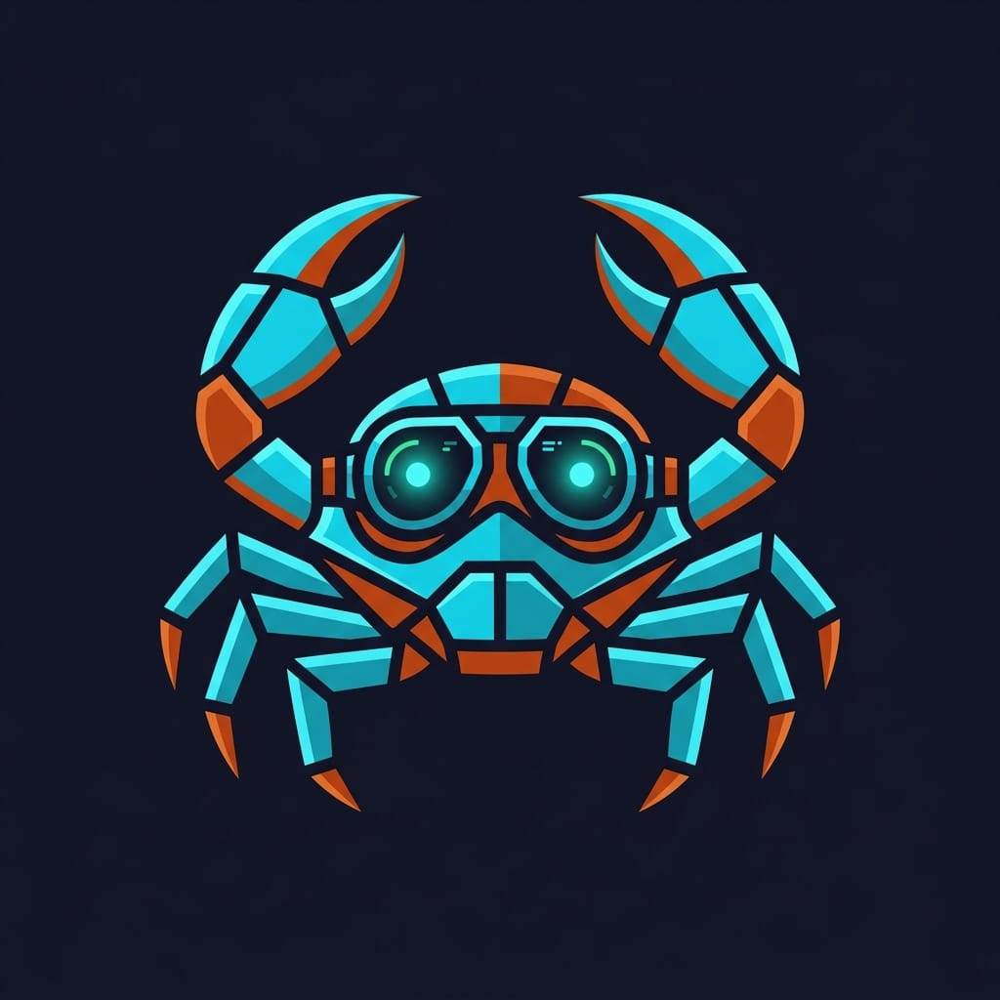

<p align="center">
  
</p>

<p align="center">
  <a href="https://github.com/mpiton/tauri-pilot/actions/workflows/ci.yml"></a>
  <a href="https://crates.io/crates/tauri-plugin-pilot"></a>
  <a href="https://github.com/mpiton/tauri-pilot/blob/main/LICENSE"></a>
  
  
  
</p>

# tauri-pilot

**Interactive testing CLI for Tauri v2 apps** — lets AI agents (Claude Code) and developers inspect, interact with, and debug Tauri applications in real-time.

<p align="center">
  
</p>

```
$ tauri-pilot snapshot -i
- heading "PR Dashboard" [ref=e1]
- textbox "Search PRs" [ref=e2] value=""
- button "Refresh" [ref=e3]
- list "PR List" [ref=e4]
  - listitem "fix: resolve memory leak #142" [ref=e5]
  - listitem "feat: add workspace support #138" [ref=e6]
- button "Load More" [ref=e7]

$ tauri-pilot click @e3
ok

$ tauri-pilot fill @e2 "workspace"
ok
```

## Why?

There's no tool for AI agents to interact with Tauri app UIs. Playwright doesn't work (Tauri uses system WebViews — WebKitGTK on Linux, WebKit on macOS, WebView2 on Windows — not Chromium). tauri-pilot bridges this gap with a lightweight plugin + CLI that speaks a protocol optimized for LLM consumption.

## How it works

```text
┌──────────────┐   Unix Socket /     ┌─────────────────────────────┐
│  tauri-pilot  │   Named Pipe (Win) │  tauri-plugin-pilot (Rust)  │
│  (CLI)        │ ◄─────────────────► │  embedded in your app       │
└──────────────┘   JSON-RPC           │                             │
                                     │  ┌─────────────────────┐   │
                                     │  │  JS Bridge (injected)│   │
                                     │  │  window.__PILOT__    │   │
                                     │  └─────────────────────┘   │
                                     │  WebView                    │
                                     └─────────────────────────────┘
```

1. **Plugin** embeds in your Tauri app (debug builds only), starts a Unix socket / Named Pipe server
2. **CLI** connects to the socket, sends JSON-RPC commands
3. **JS Bridge** injected into the WebView handles DOM inspection and interaction

## Quick Start

### 1. Add the plugin to your Tauri app

```toml
# src-tauri/Cargo.toml
[dependencies]
tauri-plugin-pilot = { git = "https://github.com/mpiton/tauri-pilot" }
```

```rust
// src-tauri/src/main.rs
fn main() {
    let mut builder = tauri::Builder::default();

    #[cfg(debug_assertions)]
    {
        builder = builder.plugin(tauri_plugin_pilot::init());
    }

    builder.run(tauri::generate_context!()).expect("error running app");
}
```

> **Required capability** — add `pilot:default` to your app's capability file
> (e.g. `src-tauri/capabilities/default.json`):
>
> ```json
> {
>   "permissions": ["core:default", "pilot:default"]
> }
> ```
>
> Without `pilot:default`, eval commands fail with: `eval timed out after 10s`.

### 2. Install the CLI

```bash
cargo install tauri-pilot-cli
```

Optionally, make it available to your Agent:

```bash
npx skills add https://github.com/mpiton/tauri-pilot
```

### 3. Use it

```bash
# Check connection
tauri-pilot ping

# Inspect the UI
tauri-pilot snapshot -i          # interactive elements only
tauri-pilot snapshot -s "#sidebar"  # scoped to a CSS selector

# Interact
tauri-pilot click @e3
tauri-pilot fill @e2 "hello"
tauri-pilot press Enter

# Verify
tauri-pilot assert text @e1 "Expected text"
tauri-pilot assert visible @e3
tauri-pilot wait --selector ".success-message"

# Debug with JavaScript
tauri-pilot eval "document.title"
tauri-pilot eval - <<'EOF'
document.querySelector('[data-id="main"]').textContent
EOF
echo 'window.location.pathname' | tauri-pilot eval -
```

Use `tauri-pilot eval -` for complex or multi-line scripts. The single-quoted heredoc
delimiter (`<<'EOF'`) disables shell expansion, so `$`, backticks, and quotes inside
the JavaScript do not need escaping.

## Commands

| Command | Description |
|---------|-------------|
| `ping` | Health check |
| `windows` | List all open windows (multi-window apps) |
| `snapshot` | Accessibility tree with refs (`--save` to persist) |
| `diff` | Compare snapshots, show only changes |
| `click` | Click an element |
| `fill` | Clear + type in an input |
| `type` | Type without clearing |
| `press` | Send a keystroke |
| `select` | Select a dropdown option |
| `check` | Toggle a checkbox |
| `scroll` | Scroll page or element |
| `drag` | Drag element to element or by offset |
| `drop` | Simulate file drop on element |
| `text` | Get element text content |
| `html` | Get element innerHTML |
| `value` | Get input value |
| `attrs` | Get all attributes |
| `eval` | Execute arbitrary JS |
| `ipc` | Call a Tauri IPC command |
| `screenshot` | Capture as PNG |
| `wait` | Wait for element to appear/disappear |
| `navigate` | Change the WebView URL |
| `url` | Get current URL |
| `title` | Get current page title |
| `state` | Get URL, title, viewport, scroll |
| `forms` | Dump all form fields on the page |
| `assert` | One-step verification (text, visible, hidden, value, count, checked, contains, url) |
| `watch` | Watch for DOM mutations |
| `storage` | Read/write localStorage and sessionStorage (`--session`) |
| `logs` | Capture and display console output |
| `network` | Capture and display network requests |
| `record` | Record interactions (`start`, `stop --output`, `status`) |
| `replay` | Replay recorded session (`--export sh` for shell script) |
| `run` | Execute a declarative TOML scenario (`--junit` for CI output) |
| `mcp` | Start a Model Context Protocol server over stdio |

## For AI Agents

tauri-pilot is designed for AI agent consumption. The workflow is:

1. `tauri-pilot snapshot -i` — get the accessibility tree with refs
2. Read the refs in the output (`@e1`, `@e2`, ...)
3. `tauri-pilot click @e3` — interact using refs
4. `tauri-pilot assert text @e1 "Dashboard"` — verify state in one step (exit 0 = pass, exit 1 = fail)
5. `tauri-pilot diff -i` — see only what changed (saves tokens vs full re-snapshot)
6. `tauri-pilot logs --level error` — check for JS errors

The `assert` command replaces the manual `text @ref` + parse + compare pattern, reducing round-trips and token usage.

Use `--json` for structured output when parsing programmatically.

### App-specific subcommand groups

For projects that want product-language operations on top of the generic primitives, register an app-specific subcommand group inside the CLI. The shipped example is the AIjia (com.aijia.app) group — 16 commands like `aijia send` / `aijia wait-reply` / `aijia ui-message`, with an iron rule that scripts only use those (never `click/eval` directly). See the "App-specific subcommand groups" section of [`SKILL.md`](SKILL.md) for the full reference.

### MCP server

For agents with native MCP support, run tauri-pilot as a stdio MCP server instead
of shelling out for each command:

```json
{
  "mcpServers": {
    "tauri-pilot": {
      "command": "tauri-pilot",
      "args": ["mcp"]
    }
  }
}
```

The MCP server exposes the same app-inspection and interaction surface as the CLI:
`snapshot`, `click`, `fill`, `logs`, `network`, `eval`, `ipc`, `assert_*`, and the
other testing tools. Use global flags before `mcp` to pin a specific app socket or
window:

```json
{
  "mcpServers": {
    "tauri-pilot": {
      "command": "tauri-pilot",
      "args": ["--socket", "/tmp/tauri-pilot-myapp.sock", "--window", "main", "mcp"]
    }
  }
}
```

## Requirements

- **Linux** (WebKitGTK), **macOS** (WebKit), or **Windows** (WebView2)
- **Tauri v2** (v1 not supported)
- **Rust 1.95.0+** (edition 2024)

## Known limitations

- **`press` and global shortcuts on X11** — synthetic key events from `press` (via `enigo`'s `XTestFakeKeyEvent` backend) frequently fail to trigger handlers registered with `tauri-plugin-global-shortcut`.

  The upstream `global-hotkey` crate uses `XGrabKey` passive grabs on its Linux/X11 backend, which match against the X server's logical modifier state. `enigo`'s separate fake-input calls for each modifier and the main keycode can desynchronize that state, so the grab's exact-modifier-mask match fails. DOM listeners and Tauri accelerators continue to receive `isTrusted=true` events.

  **Workaround**: factor the handler body into a `#[tauri::command]` and call it via `tauri-pilot ipc <command>`, or have the handler emit a Tauri event the test can re-emit — there is no way to invoke an arbitrary closure passed to `on_shortcut(...)` directly from outside the process. See [#75](https://github.com/mpiton/tauri-pilot/issues/75).

## Who uses this?

Are you using tauri-pilot? [Open a PR](https://github.com/mpiton/tauri-pilot/pulls) to add your project here!

<!-- Add your project below -->
<!-- | [Project Name](https://github.com/...) | Short description | -->

## License

MIT — see [LICENSE](LICENSE)
